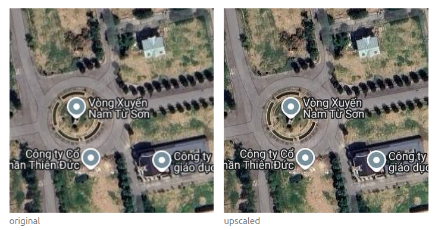

# go-rabbitmq-example

Implement a task scheduler using RabbitMQ.

- RabbitMQ Instance: [CloudAMQP Console](https://api.cloudamqp.com/console/68d88238-d435-41f2-8f44-e69aad890595/details)
- Postgres + S3 Instance: [Neon Console](https://console.neon.tech/app/projects/royal-fog-31827183/branches/br-sparkling-glitter-b3g2xkxg?database=neondb)

## Quick Start

Configure the shared environment file:

```sh
cp -n .env.example .env
# Set POSTGRES_URL, RABBITMQ_URL, and S3 connection details in .env.
```

Install dependencies and run the worker:

```sh
cd worker
npm ci
cd ..
make start-worker
```

Apply the database migration before starting the scheduler:

```sh
make migrate-up
```

Run the scheduler in another terminal:

```sh
make start-scheduler
```

To roll back the latest migration, run `make migrate-down`.

Open the web UI at `localhost:9210` (or the configured `SCHEDULER_BIND_ADDR`).

## Example Result

Human eyes are much more sensitive to brightness detail than color detail, so the model only upscales the brightness channel; color is upscaled with plain (bicubic) resizing. One channel (Y) instead of three (Y, Cb, Cr) makes the model small and fast.


